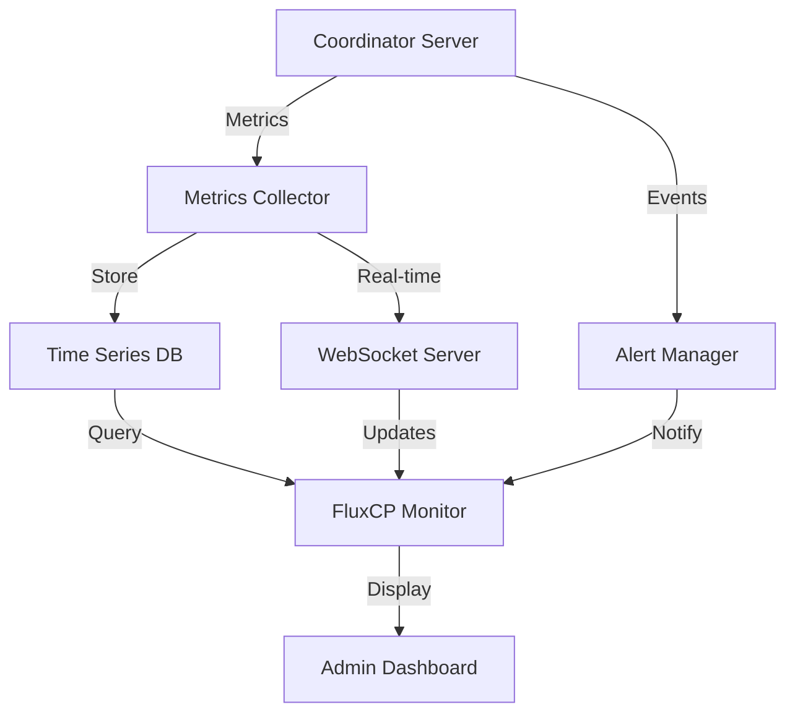

# P2P Hosting Monitoring System Setup Guide

## Overview
The P2P hosting monitoring system consists of two main components:
1. Core monitoring system integrated with the Coordinator Server
2. FluxCP monitoring interface for web-based management

## Architecture



## Installation

### 1. Core Monitoring Setup

```bash
# Install dependencies
apt-get install -y influxdb prometheus grafana

# Configure InfluxDB
cat > /etc/influxdb/influxdb.conf << EOF
[http]
  enabled = true
  bind-address = ":8086"
  auth-enabled = true

[data]
  dir = "/var/lib/influxdb/data"
  wal-dir = "/var/lib/influxdb/wal"
EOF

# Start services
systemctl enable influxdb
systemctl start influxdb
```

### 2. FluxCP Module Installation

```bash
# Install FluxCP monitoring module
cp -r FluxCP-AI-world-p2p-hosting/modules/p2p /path/to/fluxcp/modules/

# Configure module
cat > /path/to/fluxcp/config/p2p_monitor.php << EOF
<?php
return array(
    'coordinator_api' => 'http://localhost:5121',
    'websocket_url' => 'ws://localhost:5122',
    'refresh_interval' => 5000,
    'alert_channels' => array('email', 'discord'),
    'metrics_retention' => 30  // days
);
EOF
```

### 3. Database Setup

```sql
-- Create monitoring tables
CREATE TABLE `p2p_monitor_settings` (
    `setting_id` INT UNSIGNED NOT NULL AUTO_INCREMENT,
    `setting_name` VARCHAR(64) NOT NULL,
    `setting_value` TEXT NOT NULL,
    `updated_at` TIMESTAMP NOT NULL DEFAULT CURRENT_TIMESTAMP ON UPDATE CURRENT_TIMESTAMP,
    PRIMARY KEY (`setting_id`),
    UNIQUE KEY `uk_setting_name` (`setting_name`)
) ENGINE=InnoDB;

-- Insert default settings
INSERT INTO `p2p_monitor_settings` 
    (`setting_name`, `setting_value`) VALUES
    ('alert_thresholds', '{"cpu":90,"memory":85,"latency":200}'),
    ('notification_emails', '["admin@yourserver.com"]'),
    ('discord_webhook', 'https://discord.com/api/webhooks/your-webhook-url'),
    ('monitoring_interval', '5000');
```

## Configuration

### 1. Alert Configuration

```yaml
# conf/p2p/alerts.yml
alerts:
  cpu_usage:
    warning: 80
    critical: 90
    duration: 300  # seconds
    
  memory_usage:
    warning: 75
    critical: 85
    duration: 300
    
  network_latency:
    warning: 150
    critical: 200
    duration: 60
    
  error_rate:
    warning: 5
    critical: 10
    duration: 300

notifications:
  email:
    enabled: true
    recipients:
      - admin@yourserver.com
      
  discord:
    enabled: true
    webhook_url: https://discord.com/api/webhooks/your-webhook-url
    
  slack:
    enabled: false
    webhook_url: ""
```

### 2. Metrics Configuration

```yaml
# conf/p2p/metrics.yml
collection:
  interval: 5000  # ms
  batch_size: 1000
  retention_days: 30

metrics:
  system:
    enabled: true
    include:
      - cpu_usage
      - memory_usage
      - disk_usage
      - network_io
      
  game:
    enabled: true
    include:
      - player_count
      - map_status
      - mob_count
      - item_count
      
  network:
    enabled: true
    include:
      - latency
      - packet_loss
      - bandwidth_usage
      - connection_count
```

## FluxCP Monitoring Interface

### 1. Dashboard Pages

- **Overview Dashboard**: `/p2p/monitoring`
  - System health overview
  - Active alerts
  - Performance metrics
  - Map distribution

- **Host Monitoring**: `/p2p/monitoring/hosts`
  - Host list and status
  - Performance metrics
  - Hosted maps
  - Alert history

- **Map Monitoring**: `/p2p/monitoring/maps`
  - Map distribution
  - Player counts
  - Performance metrics
  - Host assignments

- **Network Status**: `/p2p/monitoring/network`
  - Connection matrix
  - Latency heatmap
  - Bandwidth usage
  - Error rates

- **Alert Management**: `/p2p/monitoring/alerts`
  - Active alerts
  - Alert history
  - Alert configuration
  - Notification settings

### 2. Real-time Updates

The monitoring system uses WebSocket connections for real-time updates:

```javascript
const wsClient = new WebSocket('ws://your-server:5122/monitor');

wsClient.onmessage = function(event) {
    const data = JSON.parse(event.data);
    switch(data.type) {
        case 'metrics':
            updateMetrics(data.metrics);
            break;
        case 'alert':
            handleAlert(data.alert);
            break;
        case 'status':
            updateStatus(data.status);
            break;
    }
};
```

### 3. Alert Handling

```php
// Alert handler in FluxCP
class AlertHandler {
    public function handleAlert($alert) {
        // Log alert
        $this->logAlert($alert);
        
        // Check severity and notify
        if ($alert['severity'] >= $this->getNotificationThreshold()) {
            $this->sendNotifications($alert);
        }
        
        // Update dashboard
        $this->updateDashboard($alert);
        
        // Trigger automatic responses
        $this->handleAutomaticResponses($alert);
    }
}
```

## Monitoring Features

### 1. System Monitoring
- CPU, Memory, and Network usage
- Host performance metrics
- Map server status
- Database synchronization status

### 2. Game Monitoring
- Player distribution
- Map performance
- NPC/Monster tracking
- Item/Economy monitoring

### 3. Network Monitoring
- Connection latency
- Packet loss tracking
- Bandwidth usage
- P2P network health

### 4. Security Monitoring
- Anti-cheat alerts
- Suspicious activity detection
- DDoS monitoring
- Authentication tracking

## Alert System

### 1. Alert Types
- Performance alerts
- Security alerts
- Network alerts
- Game state alerts

### 2. Alert Channels
- Web dashboard
- Email notifications
- Discord integration
- SMS (critical alerts)

### 3. Alert Actions
- Automatic failover
- Load balancing
- Security responses
- Admin notifications

## Maintenance

### 1. Regular Tasks
```bash
# Cleanup old metrics
php /path/to/fluxcp/tools/cleanup_metrics.php

# Rotate logs
logrotate /etc/logrotate.d/p2p-monitor

# Backup monitoring data
php /path/to/fluxcp/tools/backup_monitor_data.php
```

### 2. Health Checks
```bash
# Check monitoring system
php /path/to/fluxcp/tools/check_monitor_health.php

# Verify metrics collection
php /path/to/fluxcp/tools/verify_metrics.php

# Test alert system
php /path/to/fluxcp/tools/test_alerts.php
```

## Troubleshooting

### 1. Common Issues
- Metric collection gaps
- Alert notification failures
- Dashboard update delays
- WebSocket connection issues

### 2. Debug Tools
```bash
# Check metrics flow
php /path/to/fluxcp/tools/debug_metrics.php

# Test notification channels
php /path/to/fluxcp/tools/test_notifications.php

# Verify WebSocket server
php /path/to/fluxcp/tools/check_websocket.php
```

### 3. Log Analysis
- Monitor logs: `/var/log/p2p/monitor.log`
- Alert logs: `/var/log/p2p/alerts.log`
- Access logs: `/var/log/p2p/access.log`
- Error logs: `/var/log/p2p/error.log`