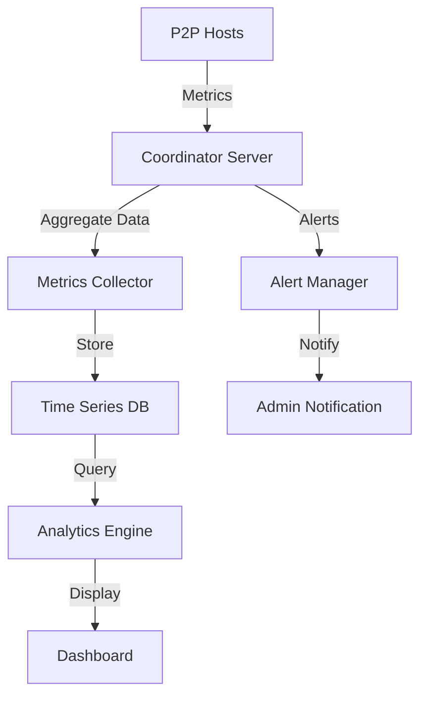

# P2P Monitoring and Analytics System

## Overview
The P2P Monitoring and Analytics System provides real-time visibility into the health, performance, and status of the P2P hosting network. This system helps administrators monitor network performance, identify issues, and make data-driven decisions.

## Architecture



## Components

### 1. Metrics Collection
- **Host Metrics**
  - CPU/Memory utilization
  - Network latency/bandwidth
  - Player count
  - Map performance metrics
  - Error rates

- **Network Metrics**
  - P2P connection quality
  - Transfer success rates
  - Failover events
  - Sync latency

- **Game Metrics**
  - Player distribution
  - Map load statistics
  - Instance performance
  - Resource utilization

### 2. Analytics Dashboard

#### Real-Time Monitoring
```
GET /api/v1/metrics/realtime
{
    "active_hosts": 25,
    "total_players": 1500,
    "network_health": 98.5,
    "average_latency": 85.2,
    "active_maps": {
        "p2p_hosted": 45,
        "vps_hosted": 10
    }
}
```

#### Performance Analytics
- Historical performance trends
- Host reliability scores
- Network optimization suggestions
- Resource utilization patterns

#### Health Monitoring
- Connection status
- Error rate tracking
- Resource availability
- Synchronization status

### 3. Alert System

#### Alert Conditions
```json
{
    "alerts": [
        {
            "type": "host_overload",
            "threshold": {
                "cpu_usage": 90,
                "memory_usage": 85,
                "player_count": 100
            },
            "severity": "high"
        },
        {
            "type": "network_degradation",
            "threshold": {
                "latency": 200,
                "packet_loss": 5,
                "sync_delay": 1000
            },
            "severity": "critical"
        }
    ]
}
```

#### Alert Channels
- Email notifications
- Discord/Slack integration
- SMS (critical alerts)
- Web dashboard

## Integration with FluxCP

### API Endpoints

```php
// MetricsController.php
class MetricsController extends BaseController {
    public function realtime() {
        return $this->metricsService->getRealTimeMetrics();
    }
    
    public function historical($timeframe) {
        return $this->metricsService->getHistoricalMetrics($timeframe);
    }
    
    public function alerts() {
        return $this->alertService->getActiveAlerts();
    }
}
```

### Database Schema

```sql
CREATE TABLE p2p_metrics (
    id BIGINT PRIMARY KEY AUTO_INCREMENT,
    timestamp DATETIME,
    host_id INT,
    metric_type VARCHAR(32),
    metric_value FLOAT,
    additional_data JSON,
    INDEX(timestamp),
    INDEX(host_id, metric_type)
);

CREATE TABLE p2p_alerts (
    id BIGINT PRIMARY KEY AUTO_INCREMENT,
    timestamp DATETIME,
    alert_type VARCHAR(32),
    severity VARCHAR(16),
    message TEXT,
    status VARCHAR(16),
    resolved_at DATETIME NULL,
    INDEX(timestamp, status)
);
```

## Configuration

### Metrics Collection
```yaml
metrics:
  collection_interval: 5000  # ms
  retention_period: 30      # days
  batch_size: 1000         # metrics per batch
  
  hosts:
    cpu_threshold: 90
    memory_threshold: 85
    latency_threshold: 200
    
  network:
    packet_loss_threshold: 5
    sync_delay_threshold: 1000
    bandwidth_minimum: 10    # Mbps

alerts:
  email:
    enabled: true
    recipients: ["admin@yourserver.com"]
  
  discord:
    enabled: true
    webhook_url: "https://discord.com/api/webhooks/..."
  
  throttling:
    max_alerts_per_minute: 10
    cooldown_period: 300    # seconds
```

## Implementation Details

### 1. Metrics Collection Flow
1. P2P hosts collect local metrics
2. Metrics are batched and sent to Coordinator
3. Coordinator aggregates and stores metrics
4. Analytics engine processes data
5. Dashboard updates in real-time

### 2. Alert Processing
1. System monitors metric thresholds
2. Alert condition detected
3. Alert manager evaluates severity
4. Notifications sent via configured channels
5. Alert status tracked until resolution

### 3. Data Retention
- Real-time data: 24 hours
- Hourly aggregates: 30 days
- Daily aggregates: 1 year
- Monthly aggregates: permanent

## Security Considerations

1. **Metrics Security**
   - Encrypted transmission
   - Access control for sensitive metrics
   - Data validation and sanitization

2. **Dashboard Security**
   - Role-based access control
   - Session management
   - Audit logging

3. **Alert Security**
   - Notification authentication
   - Alert verification
   - Rate limiting

## API Documentation

### Metrics API

#### Get Real-time Metrics
```http
GET /api/v1/metrics/realtime
Authorization: Bearer <token>
```

#### Get Historical Metrics
```http
GET /api/v1/metrics/historical
Authorization: Bearer <token>
Query Parameters:
  - timeframe: string (1h, 24h, 7d, 30d)
  - metrics: array of metric names
  - hosts: array of host IDs
```

### Alerts API

#### Get Active Alerts
```http
GET /api/v1/alerts/active
Authorization: Bearer <token>
```

#### Update Alert Status
```http
PATCH /api/v1/alerts/{id}
Authorization: Bearer <token>
Body: {
    "status": "resolved",
    "resolution_notes": "string"
}