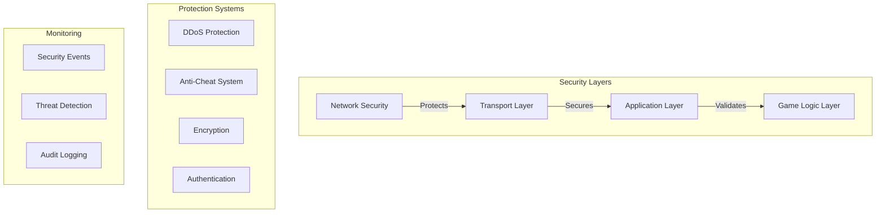

# P2P Hosting Security System

## Overview
The P2P hosting security system implements multiple layers of protection to ensure the integrity, confidentiality, and availability of the game environment. This document details the security measures implemented across different components of the system.

## Architecture



## Security Components

### 1. Network Protection

#### DDoS Mitigation
```cpp
// DDosProtection.hpp
class DDoSProtection {
public:
    struct Config {
        uint32_t rate_limit_window;     // milliseconds
        uint32_t max_connections;        // per IP
        uint32_t max_packets;           // per window
        uint32_t blacklist_threshold;   // violations
        uint32_t whitelist_duration;    // seconds
    };
    
    bool validate_connection(const NetworkAddress& addr);
    void update_metrics(const NetworkAddress& addr, uint32_t packet_count);
    void blacklist_address(const NetworkAddress& addr, uint32_t duration);
};
```

#### Rate Limiting
```yaml
rate_limits:
  connection:
    window_ms: 1000
    max_new_connections: 5
    max_total_connections: 100
  
  packets:
    window_ms: 1000
    max_packets: 100
    burst_allowance: 50
  
  actions:
    window_ms: 1000
    max_actions: 20
    cooldown_ms: 100
```

### 2. Anti-Cheat System

#### Speed Hack Detection
```cpp
class MovementValidator {
private:
    struct MovementHistory {
        Position last_pos;
        timestamp_t last_move;
        float avg_speed;
        uint32_t violations;
    };
    
    bool validate_movement(player_id_t player_id, const Position& new_pos) {
        auto& history = movement_history_[player_id];
        
        float speed = calculate_speed(history.last_pos, new_pos,
                                   current_time() - history.last_move);
                                   
        if (speed > MAX_ALLOWED_SPEED * 1.1f) {
            handle_violation(player_id, ViolationType::SPEED_HACK);
            return false;
        }
        
        return true;
    }
};
```

#### Memory Protection
```cpp
// GameState protection
class ProtectedGameState {
private:
    std::vector<uint8_t> state_data_;
    std::array<uint8_t, 32> state_hash_;
    
    bool verify_state_integrity() {
        auto current_hash = calculate_state_hash(state_data_);
        return crypto::constant_time_compare(current_hash, state_hash_);
    }
    
    void update_state(const std::vector<uint8_t>& new_state) {
        state_data_ = new_state;
        state_hash_ = calculate_state_hash(state_data_);
    }
};
```

#### Packet Validation
```cpp
class PacketValidator {
public:
    bool validate_packet(const NetworkPacket& packet) {
        if (!verify_packet_signature(packet)) {
            log_security_event("Invalid packet signature",
                             packet.get_session());
            return false;
        }
        
        if (!validate_packet_sequence(packet)) {
            log_security_event("Invalid packet sequence",
                             packet.get_session());
            return false;
        }
        
        return true;
    }
};
```

### 3. Encryption System

#### Key Management
```cpp
class KeyManager {
private:
    struct KeySet {
        std::array<uint8_t, 32> encryption_key;
        std::array<uint8_t, 32> hmac_key;
        timestamp_t creation_time;
        uint32_t rotation_counter;
    };
    
    KeySet current_keys_;
    std::queue<KeySet> previous_keys_;
    
    void rotate_keys() {
        auto new_keys = generate_key_set();
        previous_keys_.push(current_keys_);
        current_keys_ = new_keys;
        
        if (previous_keys_.size() > MAX_OLD_KEYS) {
            previous_keys_.pop();
        }
    }
};
```

#### Secure Communication
```cpp
class SecureChannel {
public:
    bool send_encrypted(const NetworkPacket& packet) {
        // Add packet metadata
        PacketMetadata metadata{
            .timestamp = current_time(),
            .sequence = next_sequence_++,
            .flags = packet.get_flags()
        };
        
        // Encrypt packet
        auto encrypted = encrypt_packet(packet, metadata);
        if (!encrypted) {
            return false;
        }
        
        // Sign packet
        auto signature = sign_packet(*encrypted, metadata);
        
        // Send packet
        return send_packet(*encrypted, metadata, signature);
    }
};
```

### 4. Authentication System

#### Session Management
```cpp
class SessionManager {
private:
    struct SessionData {
        std::string token;
        timestamp_t creation_time;
        timestamp_t last_activity;
        uint32_t permissions;
        NetworkAddress address;
    };
    
    bool validate_session(const std::string& token) {
        auto session = sessions_.find(token);
        if (session == sessions_.end()) {
            return false;
        }
        
        if (is_session_expired(session->second)) {
            sessions_.erase(session);
            return false;
        }
        
        session->second.last_activity = current_time();
        return true;
    }
};
```

#### Access Control
```cpp
class AccessController {
public:
    bool check_permission(player_id_t player_id,
                         const std::string& action,
                         const std::string& resource) {
        auto permissions = get_player_permissions(player_id);
        return validate_permission(permissions, action, resource);
    }
    
private:
    struct Permission {
        std::string action;
        std::string resource;
        bool allow;
    };
    
    std::unordered_map<player_id_t,
                       std::vector<Permission>> permissions_;
};
```

### 5. Audit System

#### Security Event Logging
```sql
CREATE TABLE security_events (
    id BIGINT PRIMARY KEY AUTO_INCREMENT,
    event_type VARCHAR(32) NOT NULL,
    severity ENUM('low', 'medium', 'high', 'critical') NOT NULL,
    source_type VARCHAR(32) NOT NULL,
    source_id VARCHAR(64) NOT NULL,
    details JSON,
    timestamp DATETIME DEFAULT CURRENT_TIMESTAMP,
    resolution_status ENUM('open', 'investigating', 'resolved', 'false_positive'),
    resolution_notes TEXT,
    INDEX(event_type, severity),
    INDEX(timestamp)
);
```

#### Event Monitoring
```cpp
class SecurityMonitor {
public:
    void monitor_events() {
        while (running_) {
            process_security_events();
            update_threat_levels();
            check_alert_conditions();
            std::this_thread::sleep_for(
                std::chrono::milliseconds(100));
        }
    }
    
private:
    struct ThreatLevel {
        float base_score;
        float temporal_score;
        float environmental_score;
    };
    
    void update_threat_levels() {
        for (auto& [source, events] : active_events_) {
            auto threat = calculate_threat_level(events);
            if (threat.base_score > THREAT_THRESHOLD) {
                trigger_security_response(source, threat);
            }
        }
    }
};
```

## Security Configurations

### 1. Network Security
```yaml
network_security:
  ddos_protection:
    enabled: true
    rate_limit_window: 1000
    max_connections: 100
    max_packets: 1000
    blacklist_threshold: 5
    whitelist_duration: 3600
  
  encryption:
    algorithm: "AES-256-GCM"
    key_rotation_interval: 3600
    min_key_length: 32
    
  authentication:
    token_validity: 3600
    max_failed_attempts: 5
    lockout_duration: 900
```

### 2. Anti-Cheat Configuration
```yaml
anti_cheat:
  movement_validation:
    max_speed: 450
    teleport_threshold: 1000
    position_check_interval: 100
    
  state_validation:
    check_interval: 1000
    max_desync_tolerance: 100
    integrity_check_method: "sha256"
    
  action_validation:
    max_actions_per_second: 10
    skill_cooldown_tolerance: 50
    damage_validation_enabled: true
```

### 3. Monitoring Configuration
```yaml
security_monitoring:
  event_processing:
    check_interval: 100
    batch_size: 1000
    retention_days: 90
    
  alerts:
    min_severity: "medium"
    notification_channels:
      - email
      - discord
      - sms
      
  audit_logging:
    enabled: true
    log_level: "info"
    include_sensitive_data: false
```

## Implementation Guidelines

### 1. Secure Development Practices
- Input validation for all data
- Proper error handling
- Secure session management
- Safe memory management
- Regular security updates

### 2. Deployment Security
- Secure configuration management
- Regular security audits
- Incident response planning
- Backup and recovery procedures
- Environment isolation

### 3. Monitoring and Maintenance
- Real-time security monitoring
- Regular system updates
- Performance optimization
- Security patch management
- Incident response procedures

## Security Best Practices

1. **Network Security**
   - Always use encrypted connections
   - Implement proper rate limiting
   - Validate all network packets
   - Monitor for suspicious activity

2. **Anti-Cheat Measures**
   - Regular integrity checks
   - Client-side validation
   - Server-side verification
   - Behavioral analysis

3. **Data Protection**
   - Encrypt sensitive data
   - Secure key management
   - Regular backups
   - Access control enforcement

4. **Incident Response**
   - Clear escalation procedures
   - Automated responses
   - Incident documentation
   - Post-incident analysis