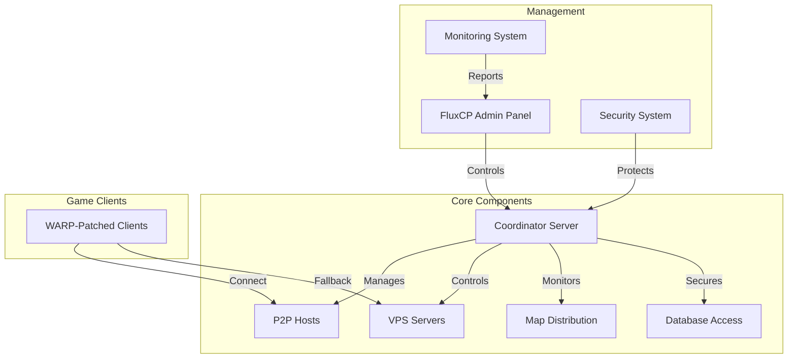

# rAthena P2P Hosting System Overview

## System Architecture



## Components Overview

### 1. Core Systems
- **Coordinator Server**: Central management for P2P network
- **P2P Host System**: Distributed map hosting
- **Map Distribution**: Dynamic map assignment
- **Database Proxy**: Secure data synchronization

### 2. Management Tools
- **Admin Panel**: FluxCP-integrated control interface
- **Monitoring System**: Real-time network oversight
- **Security System**: Multi-layered protection

### 3. Client Integration
- **WARP Patches**: P2P hosting capabilities
- **Network Protocol**: Enhanced communication
- **Security Measures**: Client-side protection

## Installation Guide

### 1. Prerequisites
```bash
# Required packages
apt-get install -y \
    build-essential \
    cmake \
    libssl-dev \
    libmysqlclient-dev \
    libpcre3-dev \
    zlib1g-dev
```

### 2. Core System Setup

```bash
# Clone repositories
git clone https://github.com/your-repo/rathena-AI-world.git
git clone https://github.com/your-repo/FluxCP-AI-world-p2p-hosting.git
git clone https://github.com/your-repo/WARP-p2p-client.git

# Build rAthena with P2P support
cd rathena-AI-world
mkdir build && cd build
cmake -DBUILD_P2P=ON ..
make -j$(nproc)
```

### 3. Database Setup
```sql
-- Initialize P2P tables
mysql -u user -p your_database < sql/p2p_schema.sql

-- Grant permissions
GRANT SELECT, INSERT, UPDATE ON p2p_* TO 'rathena'@'localhost';
```

### 4. Configuration

#### Coordinator Server
```yaml
# conf/p2p/p2p.conf
coordinator:
  port: 5121
  db_proxy_port: 5122
  max_connections: 1000
  
security:
  encryption_enabled: true
  key_rotation_interval: 3600
  
monitoring:
  metrics_interval: 5000
  alert_enabled: true
```

#### Host Node
```yaml
# conf/p2p/host_node.conf
node:
  max_maps: 5
  max_players: 100
  update_interval: 50
  
resources:
  cpu_limit: 80
  memory_limit: 85
  network_limit: 100
```

### 5. FluxCP Integration
```bash
# Install FluxCP P2P module
cp -r FluxCP-AI-world-p2p-hosting/modules/p2p /path/to/fluxcp/modules/

# Configure module
cp FluxCP-AI-world-p2p-hosting/config/p2p.php /path/to/fluxcp/config/
```

### 6. Client Preparation
```bash
# Apply WARP patches
cd WARP-p2p-client
./apply-patches.sh /path/to/client/ragexe.exe

# Configure client
cp p2p_config.ini /path/to/client/DATA.INI
```

## Deployment Guide

### 1. Service Setup

#### Coordinator Service
```ini
# /etc/systemd/system/p2p-coordinator.service
[Unit]
Description=rAthena P2P Coordinator Server
After=network.target mysql.service

[Service]
Type=simple
User=rathena
WorkingDirectory=/opt/rathena
ExecStart=/opt/rathena/bin/coordinator-server
Restart=always

[Install]
WantedBy=multi-user.target
```

#### Monitoring Service
```ini
# /etc/systemd/system/p2p-monitor.service
[Unit]
Description=rAthena P2P Monitoring System
After=p2p-coordinator.service

[Service]
Type=simple
User=rathena
WorkingDirectory=/opt/rathena
ExecStart=/opt/rathena/bin/p2p-monitor
Restart=always

[Install]
WantedBy=multi-user.target
```

### 2. Security Setup

```bash
# Generate encryption keys
openssl genpkey -algorithm ED25519 -out /etc/rathena/p2p/keys/coordinator.key
openssl pkey -in /etc/rathena/p2p/keys/coordinator.key -pubout -out /etc/rathena/p2p/keys/coordinator.pub

# Set permissions
chown -R rathena:rathena /etc/rathena/p2p/keys
chmod 600 /etc/rathena/p2p/keys/coordinator.key
```

### 3. Monitoring Setup

```bash
# Configure log rotation
cat > /etc/logrotate.d/p2p-system << EOF
/var/log/rathena/p2p/*.log {
    daily
    rotate 14
    compress
    delaycompress
    notifempty
    create 640 rathena rathena
    sharedscripts
    postrotate
        systemctl kill -s USR1 p2p-coordinator.service
        systemctl kill -s USR1 p2p-monitor.service
    endscript
}
EOF
```

## Operation Guide

### 1. Starting the System
```bash
# Start core services
systemctl start p2p-coordinator
systemctl start p2p-monitor

# Verify status
systemctl status p2p-coordinator
systemctl status p2p-monitor
```

### 2. Monitoring
- Access FluxCP admin panel: `http://your-server/p2p/dashboard`
- Check logs: `tail -f /var/log/rathena/p2p/*.log`
- Monitor metrics: `http://your-server/p2p/metrics`

### 3. Maintenance

#### Regular Tasks
```bash
# Backup database
mysqldump -u root -p --databases rathena > backup/rathena_$(date +%Y%m%d).sql

# Check logs
journalctl -u p2p-coordinator -n 100

# Rotate keys
p2p-keygen --rotate
```

#### Emergency Procedures
1. Failover to VPS:
   ```bash
   p2p-control --emergency-failover
   ```

2. Reset P2P network:
   ```bash
   p2p-control --reset-network
   ```

3. Restore from backup:
   ```bash
   p2p-control --restore-state backup/state.dat
   ```

## Troubleshooting

### 1. Common Issues
- Connection problems: Check firewall settings
- Performance issues: Monitor host metrics
- Sync errors: Verify database connectivity

### 2. Debug Tools
```bash
# Network diagnostics
p2p-diagnostic --network

# Performance analysis
p2p-diagnostic --performance

# Security audit
p2p-diagnostic --security
```

### 3. Support Resources
- Documentation: `/doc/`
- Issue Tracker: GitHub repository
- Community Forum: rAthena forums

## Future Enhancements

1. **Planned Features**
   - Advanced load prediction
   - Machine learning-based host selection
   - Enhanced anti-cheat measures

2. **Optimization Goals**
   - Reduce latency
   - Improve scalability
   - Enhance security

3. **Community Contributions**
   - Plugin system
   - Custom map support
   - Extended monitoring tools